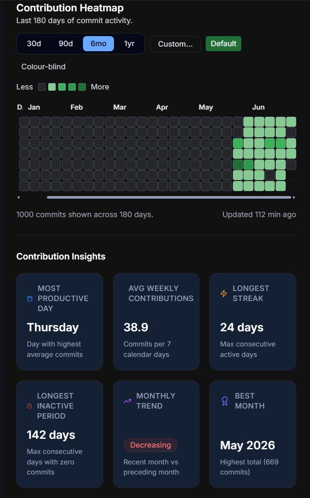
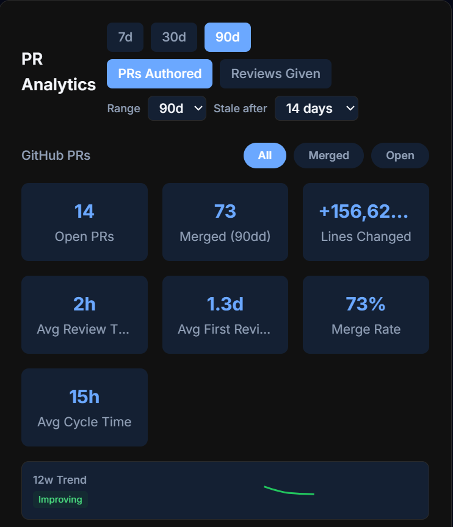
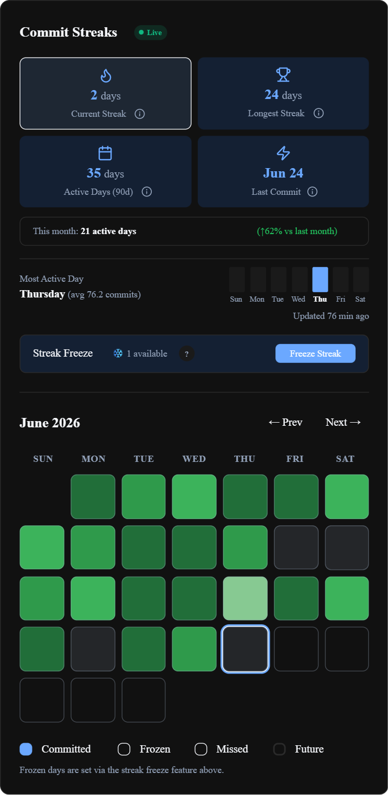
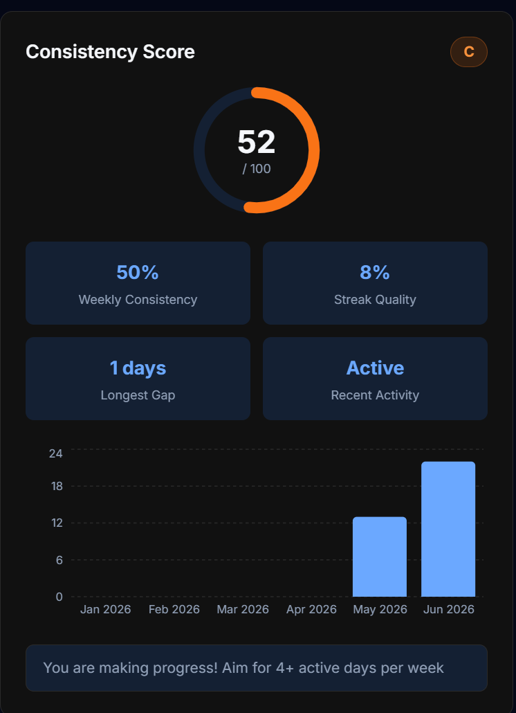
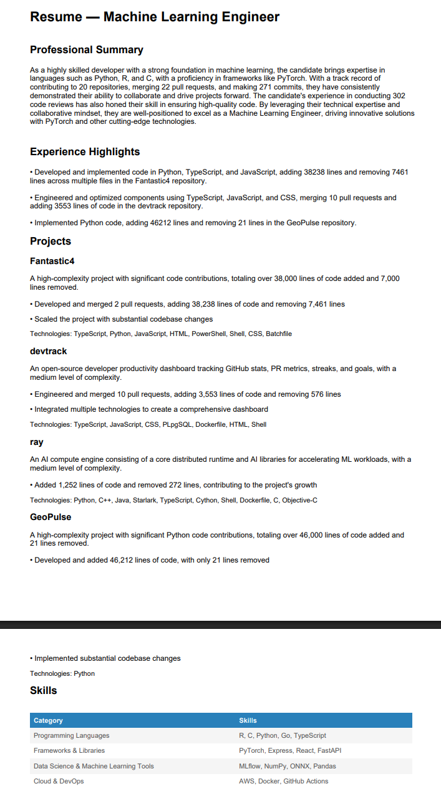
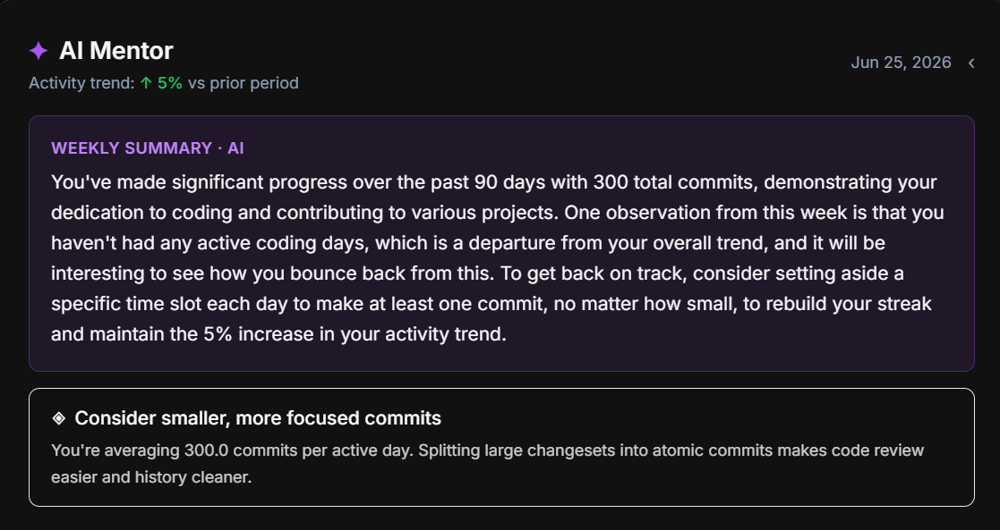
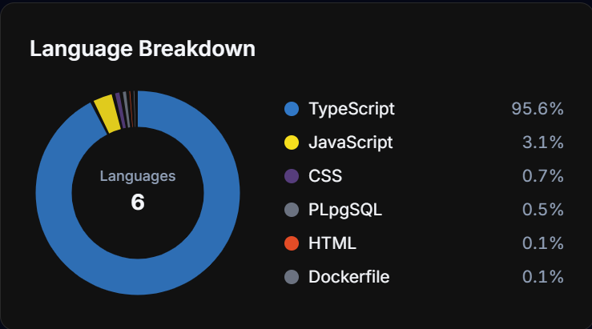
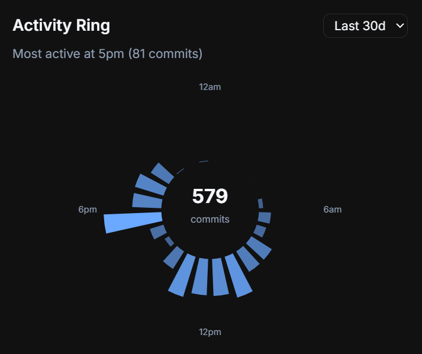

<div align="center">

# DevTrack

**The open-source command center for your developer life.**

Track your GitHub activity, commit streaks, PR analytics, and coding goals in one clean,
self-hostable dashboard — no enterprise plan, no vendor lock-in, your data stays yours.

<br />

[](https://github.com/Priyanshu-byte-coder/devtrack/actions/workflows/ci.yml)
[](./LICENSE)
[](https://github.com/Priyanshu-byte-coder/devtrack/stargazers)
[](https://github.com/Priyanshu-byte-coder/devtrack/graphs/contributors)
[](https://github.com/Priyanshu-byte-coder/devtrack/issues?q=is%3Aissue+is%3Aopen+label%3A%22good+first+issue%22)
[](https://github.com/Priyanshu-byte-coder/devtrack/commits/main)

<br />

[**Live Demo**](https://devtrack-silk-kappa.vercel.app) · [**Documentation**](#documentation) · [**Contributing**](#contributing) · [**Report a Bug**](https://github.com/Priyanshu-byte-coder/devtrack/issues/new?template=bug_report.yml) · [**Request a Feature**](https://github.com/Priyanshu-byte-coder/devtrack/issues/new?template=feature_request.yml) · [**Discussions**](https://github.com/Priyanshu-byte-coder/devtrack/discussions)

<br />

[](https://vercel.com/new/clone?repository-url=https%3A%2F%2Fgithub.com%2FPriyanshu-byte-coder%2Fdevtrack&project-name=devtrack&repository-name=devtrack&env=NEXT_PUBLIC_SUPABASE_URL,NEXT_PUBLIC_SUPABASE_ANON_KEY,SUPABASE_SERVICE_ROLE_KEY,NEXTAUTH_URL,NEXTAUTH_SECRET,GITHUB_ID,GITHUB_SECRET,ENCRYPTION_KEY&envDescription=Supabase%20keys%2C%20GitHub%20OAuth%20app%20credentials%2C%20and%20a%20NextAuth%20secret&envLink=https%3A%2F%2Fgithub.com%2FPriyanshu-byte-coder%2Fdevtrack%2Fblob%2Fmain%2FDEVELOPMENT.md)

<br />


</div>

<br />

---

## Why DevTrack

Most developers track their work across disconnected tools — GitHub for commits, Jira for tasks, Notion for goals. None of them show the full picture of how you actually code.

DevTrack pulls it all into one place:

- **One dashboard** for contributions, PR metrics, streaks, languages, and goals
- **AI-powered career tools** — resume generation, coding personality, weekly insights, and a mentor that knows your history
- **Truly yours** — fully self-hostable on the free tiers of Vercel and Supabase, with complete data export
- **Built in the open** — shaped by hundreds of contributors, and always looking for the next one

If DevTrack looks useful to you, **[star the repository](https://github.com/Priyanshu-byte-coder/devtrack/stargazers)** — stars are how open-source projects grow, and each one genuinely helps more developers discover it.

---

## See It in Action

<table>
  <tr>
    <td width="50%" align="center">
      
      <br /><sub><b>Contribution Heatmap</b> — 365-day activity calendar with repository and language filters</sub>
    </td>
    <td width="50%" align="center">
      
      <br /><sub><b>PR Analytics</b> — review times, merge rates, and PR breakdowns at a glance</sub>
    </td>
  </tr>
  <tr>
    <td width="50%" align="center">
      
      <br /><sub><b>Streak Tracker</b> — current streak, longest streak, and streak freezes for planned breaks</sub>
    </td>
    <td width="50%" align="center">
      
      <br /><sub><b>Consistency Score</b> — how steady your coding rhythm really is</sub>
    </td>
  </tr>
  <tr>
    <td width="50%" align="center">
      
      <br /><sub><b>AI Resume Generator</b> — turn your real GitHub history into a polished, role-targeted resume</sub>
    </td>
    <td width="50%" align="center">
      
      <br /><sub><b>AI Mentor</b> — personalized guidance based on your actual coding activity</sub>
    </td>
  </tr>
  <tr>
    <td width="50%" align="center">
      
      <br /><sub><b>Language Breakdown</b> — where your code time actually goes</sub>
    </td>
    <td width="50%" align="center">
      
      <br /><sub><b>Activity Rings</b> — daily coding movement, closed one ring at a time</sub>
    </td>
  </tr>
</table>

<div align="center">


<br /><sub><b>Year Wrapped</b> — your annual coding journey, beautifully visualized and shareable</sub>

</div>

---

## Features

**Analytics and insights**

- Commit activity charts with 7 / 14 / 30 / 90-day ranges
- Contribution heatmap with repository and language filters, plus color-blind-friendly themes
- PR analytics: average review time, merge rate, open/closed breakdowns
- Language breakdown, coding time, consistency score, activity rings, and personal records
- CI analytics and community metrics for your repositories

**AI-powered career tools**

- Resume generator built from your real GitHub history
- AI mentor with personalized, activity-aware guidance
- Coding personality analysis and an AI roast for the brave
- Weekly natural-language insight summaries

**Goals and motivation**

- Goal tracker with weekly/monthly recurrence and automatic progress sync from live GitHub data
- Commit streak tracking with streak freezes for planned breaks
- Opt-in public leaderboard ranked by streak, commits, and PRs
- Year Wrapped: an animated annual recap

**Sharing and social**

- Public profile at `/u/username` with stats, badges, and pinned repositories
- Embeddable SVG badges for streaks and commit counts
- Friend comparison, collaboration rooms, and shareable profile cards
- RSS feed for your public activity

**Platform**

- Sign in with GitHub — no separate account
- Multi-account support with instant switching
- Real-time dashboard updates via Supabase Realtime
- Discord and Wakatime integrations, weekly email digest
- Full data export (JSON and PDF), PWA support, and multiple UI themes

---

## Quick Start

There are three ways to use DevTrack, from zero effort to full control:

**1. Try the hosted demo** — no setup at all: [devtrack-silk-kappa.vercel.app](https://devtrack-silk-kappa.vercel.app)

**2. Deploy your own in one click** — the Vercel button above walks you through the required environment variables. You'll need a free [Supabase](https://supabase.com) project and a [GitHub OAuth App](https://github.com/settings/applications/new).

**3. Run it locally**

```bash
git clone https://github.com/Priyanshu-byte-coder/devtrack.git
cd devtrack
pnpm install
cp .env.example .env.local   # fill in Supabase + GitHub OAuth credentials
pnpm dev
```

Open [http://localhost:3000](http://localhost:3000) and sign in with GitHub.

The full walkthrough — Supabase migrations, OAuth app setup, every environment variable explained — lives in **[DEVELOPMENT.md](./DEVELOPMENT.md)**. Prefer containers? See the **[Docker guide](./docs/docker.md)**. Deploying to your own infrastructure? See the **[Self-Hosting Guide](./docs/self-hosting.md)**.

---

## Tech Stack

| Layer | Technology |
|---|---|
| Frontend | Next.js 16 (App Router), TypeScript, Tailwind CSS |
| Auth | GitHub OAuth via NextAuth.js |
| Database | Supabase (PostgreSQL) with Row Level Security |
| Charts | Recharts |
| AI | Groq API |
| Testing | Vitest, Playwright (E2E + visual regression) |
| Deployment | Vercel — runs entirely on free tiers |

---

## Documentation

| Guide | What it covers |
|---|---|
| [DEVELOPMENT.md](./DEVELOPMENT.md) | Local setup, environment variables, project structure, adding widgets |
| [Self-Hosting Guide](./docs/self-hosting.md) | Deploying your own production instance |
| [Docker Guide](./docs/docker.md) | Containerized local development |
| [Architecture Overview](./docs/architecture.md) | System diagrams: frontend, API routes, Supabase schema, sync flows |
| [API Reference](./docs/api.md) | REST API usage guide — interactive Swagger UI at `/api-docs` |
| [FAQ](./docs/faq.md) | OAuth setup, login issues, testing, supported versions |
| [Caching Guidelines](./docs/caching.md) | Caching patterns used across the codebase |

---

## Contributing

DevTrack is built by its community — over two hundred developers have shipped code here, many with their first-ever open-source contribution. You're welcome regardless of experience level, and maintainers actively review and mentor.

**Getting started takes four steps:**

1. Browse [open issues](https://github.com/Priyanshu-byte-coder/devtrack/issues) — the [`good first issue`](https://github.com/Priyanshu-byte-coder/devtrack/issues?q=is%3Aissue+is%3Aopen+label%3A%22good+first+issue%22) label is curated for newcomers
2. Comment on the issue to get assigned before you start
3. Fork, branch from `main` (for example `feat/issue-42-description`), and open a PR
4. Make sure CI passes locally: `pnpm run lint && pnpm run type-check && pnpm test`

**[CONTRIBUTING.md](./CONTRIBUTING.md)** covers commit style, branch naming, and the review process. Questions are always welcome in [Discussions](https://github.com/Priyanshu-byte-coder/devtrack/discussions).

DevTrack participates in **GSSoC** (GirlScript Summer of Code) — program participants can find labeled issues and scoring details in the contributing guide.

**Looking for something bigger?** These are open on the roadmap:

| Feature | Difficulty |
|---|---|
| GitLab integration | Advanced |
| Team dashboards | Advanced |
| Embeddable stats widgets | Intermediate |
| Jira integration | Advanced |
| Mobile app (React Native) | Advanced |

Open an issue to claim one and discuss the approach first.

---

## Community and Support

- [GitHub Discussions](https://github.com/Priyanshu-byte-coder/devtrack/discussions) — questions, ideas, show what you've built
- [Issues](https://github.com/Priyanshu-byte-coder/devtrack/issues/new/choose) — bug reports and feature requests
- [Email the maintainer](mailto:doshipriyanshu3@gmail.com) — anything else

All contributors are expected to follow the [Code of Conduct](./CODE_OF_CONDUCT.md).

---

## Support the Project

DevTrack is free, open source, and runs on donated infrastructure. Three ways to help, in order of impact:

1. **Star the repository** — it costs nothing and directly helps other developers find the project
2. **Contribute** — code, docs, bug reports, and reviews all move DevTrack forward
3. **Sponsor** — funds the hosted demo, AI API costs, and maintainer time: [GitHub Sponsors](https://github.com/sponsors/Priyanshu-byte-coder) · [Buy Me a Chai](https://www.buymeachai.in/devtrack)

Sponsor tiers and a company-ready sponsorship brief are in [docs/SPONSORS.md](./docs/SPONSORS.md).

DevTrack is proudly built on [Supabase](https://supabase.com), [Vercel](https://vercel.com), [Groq](https://groq.com), and [Wakatime](https://wakatime.com).

---

## Star History

<div align="center">

<a href="https://star-history.com/#Priyanshu-byte-coder/devtrack&Date">
  <picture>
    <source media="(prefers-color-scheme: dark)" srcset="https://api.star-history.com/svg?repos=Priyanshu-byte-coder/devtrack&type=Date&theme=dark" />
    <source media="(prefers-color-scheme: light)" srcset="https://api.star-history.com/svg?repos=Priyanshu-byte-coder/devtrack&type=Date" />
    
  </picture>
</a>

</div>

---

## License

MIT — see [LICENSE](./LICENSE) for details.

## Maintainers

| Name | GitHub | Role |
|---|---|---|
| Priyanshu Doshi | [@Priyanshu-byte-coder](https://github.com/Priyanshu-byte-coder) | Founder & Maintainer |
| Saahil Doshi | [@Legit-Ox](https://github.com/Legit-Ox) | Maintainer |

## Contributors

Thanks to everyone who has helped build DevTrack. Want to see your avatar here? Pick a [good first issue](https://github.com/Priyanshu-byte-coder/devtrack/issues?q=is%3Aissue+is%3Aopen+label%3A%22good+first+issue%22) and join in.

<div align="center">

<a href="https://github.com/Priyanshu-byte-coder/devtrack/graphs/contributors">
  
</a>

<br /><br />

Built by the DevTrack community · [devtrack-silk-kappa.vercel.app](https://devtrack-silk-kappa.vercel.app)

**If DevTrack is useful to you, a star goes a long way.**

</div>
