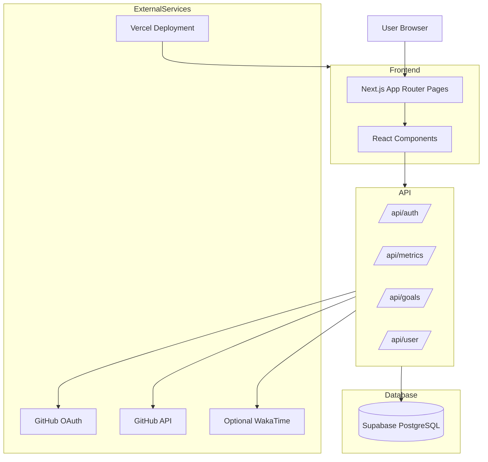

# DevTrack Architecture Overview

This document explains the high-level architecture and data flow of DevTrack.

---

## System Architecture



---

## Frontend Layer

- Built using Next.js App Router
- Uses reusable React components for dashboard widgets
- Tailwind CSS for styling

---

## API Layer

Handles:

- authentication
- GitHub sync
- metrics aggregation
- goals management
- user settings

---

## Database Layer

Supabase PostgreSQL stores:

- users
- goals
- metrics
- streak data
- cached GitHub activity

---

## External Services

### GitHub OAuth

Used for secure authentication.

### GitHub API

Used for:

- commits
- pull requests
- repositories
- contribution activity

### Vercel

Hosts the production deployment.

### WakaTime (optional)

Can provide coding activity metrics.

---

## Data Flow

1. User signs in with GitHub OAuth
2. API fetches GitHub activity
3. Metrics are processed and stored in Supabase
4. Dashboard components fetch and render analytics


### GSSoC Database Connection Pooling Guide

#### Overview
Connection pooling is essential for managing concurrent database access efficiently. This guide standardizes pooling practices across GSSoC contributions to DevTrack.

#### Pool Size Limits
- **Development**: Set pool size to 5-10 connections to prevent memory spikes
- **Production**: Set pool size to 20-50 connections based on available RAM
- **Supabase Free Tier**: Max 500 connections; use aggressive pooling to stay within limits

#### Best Practices
- Always release connections back to the pool after query completion
- Use connection timeouts (30s default) to prevent hung connections
- Monitor pool exhaustion via `pg_stat_activity` in production
- Never open more connections than the configured pool max
- Use `supabaseAdmin` (service role) only server-side; never expose to clients

#### Connection Pool Configuration Example
```typescript
// src/lib/supabase.ts
import { createClient } from "@supabase/supabase-js";

export const supabaseAdmin = createClient(
  process.env.NEXT_PUBLIC_SUPABASE_URL ?? "",
  process.env.SUPABASE_SERVICE_ROLE_KEY ?? "",
  {
    db: {
      pool: { max: 20, idleTimeoutMillis: 30000 },
    },
  }
);
```

#### GSSoC Contribution Checklist
- [ ] Pool limits are configured per environment
- [ ] Connections are released in `finally` blocks or via `Promise.finally()`
- [ ] No connection leaks in error paths
- [ ] Pool size is documented in the PR description
